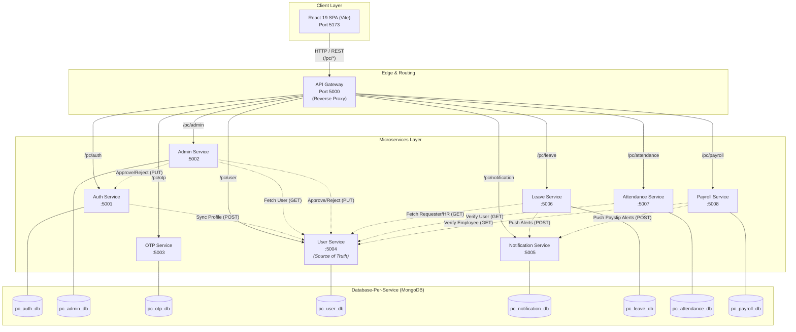
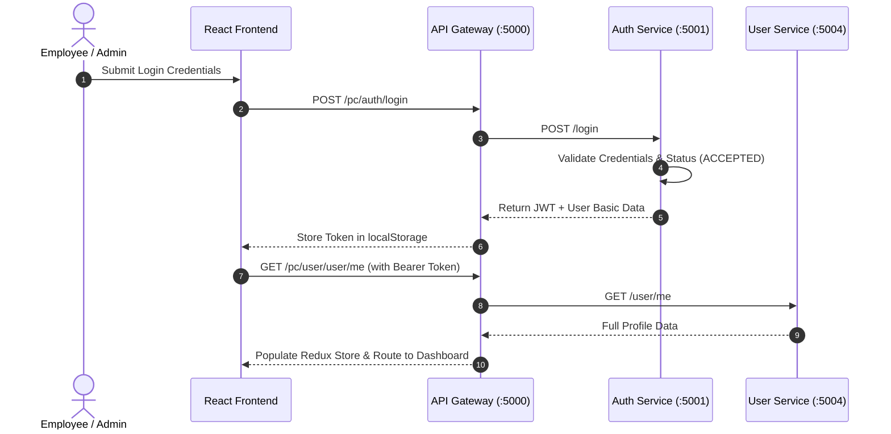

# PeopleCore — Human Resource Management System

<div align="center">

**A production-ready, full-stack HR management platform built with React 19, Node.js, Express, MongoDB, and a decoupled Database-Per-Service microservices architecture.**

[](https://react.dev/)
[](https://vitejs.dev/)
[](https://nodejs.org/)
[](https://expressjs.com/)
[](https://www.mongodb.com/)
[](https://redux-toolkit.js.org/)
[](https://tailwindcss.com/)

</div>

---

## 📑 Contents

- [Overview](#-overview)
- [Key Features](#-key-features)
- [Technology Stack](#-technology-stack)
- [System Architecture](#-system-architecture)
- [Database-Per-Service Architecture](#-database-per-service-architecture)
- [Microservices Overview](#-microservices-overview)
- [Role-Based Access Control](#-role-based-access-control)
- [Default Team Accounts](#-default-team-accounts)
- [Project Structure](#-project-structure)
- [Getting Started](#-getting-started)
- [Environment Configuration](#-environment-configuration)
- [API Reference](#-api-reference)
- [Internal Interservice APIs](#-internal-interservice-apis)
- [Contributing](#-contributing)

---

## 🌟 Overview

**PeopleCore** is a modern Human Resource Management System (HRMS) engineered to streamline organizational management, employee self-service, leave administration, attendance logging, notifications, announcements, and payroll processing.

The backend is architected with **9 independent microservices** governed by an **API Gateway**, employing a **Database-Per-Service pattern** where each service manages its own isolated MongoDB database. Cross-service communication is achieved via lightweight internal HTTP endpoints with `user-service` acting as the single source of truth for user identities and profiles.

---

## 🚀 Key Features

### 🔐 Authentication & Identity
- **JWT Authentication:** Stateless token-based auth with secure password hashing via `bcryptjs`.
- **Email OTP Verification:** Automated OTP delivery and verification for registration.
- **Account Approval Workflow:** Admin/HR review and approval for newly registered employees.
- **Role-Based Authorization:** Strict tiered access control for `ADMIN`, `HR`, and `EMPLOYEE`.

### 👥 Employee Management
- **Directory & Profiles:** Full employee profiles with department, designation, contact info, bio, avatar, and join dates.
- **Dynamic Onboarding:** Real-time updates and account status management (`PENDING`, `ACCEPTED`, `REJECTED`).

### ⏱️ Attendance Tracking
- **Daily Check-In / Check-Out:** Live timestamp logging with status tags (`PRESENT`, `LATE`, `HALF_DAY`).
- **Personal History & Analytics:** Real-time monthly and daily breakdown for employees.
- **Admin/HR Attendance Stats:** High-level organizational overview with presentee and absenteeism metrics.

### 🌴 Leave Management
- **Application Workflow:** Request Paid, Casual, Sick, or Unpaid leaves with real-time day calculations.
- **Review Pipeline:** Interactive approval and rejection workflow for HR and Admins.
- **Status Badges & History:** Instant status updates with rejection reasons and historical logs.

### 💰 Payroll & Compensation
- **Salary Structure Management:** Configure employee annual CTC with auto-calculated components (Basic, HRA, Special Allowance, PF, TDS).
- **Automated Payslip Generation:** Batch payslip generation by pay period with downloadable/printable slips.
- **Direct Bank Details:** Configurable bank, account number, and IFSC records.

### 📢 Announcements & Notifications
- **Broadcast Notices:** Company-wide announcements with priority tagging (`URGENT`, `EVENT`, `INFO`) and pinning.
- **In-App Notifications:** Real-time system alerts, leave approval alerts, and unread badge counters.

---

## 🛠 Technology Stack

### Frontend
| Technology | Version | Purpose |
| :--- | :---: | :--- |
| **React** | 19.x | Modern Component-Based SPA UI |
| **Vite** | 7.x | Next-gen Frontend Tooling & Dev Server |
| **Tailwind CSS** | 4.x | Utility-first Design System & Dark Mode |
| **Redux Toolkit** | 2.x | Centralized Client State Management |
| **React Router DOM** | 7.x | Client-side Declarative Routing |
| **Lucide React** | 0.475+ | Minimalist Icon System |

### Backend Microservices
| Technology | Purpose |
| :--- | :--- |
| **Node.js** | Non-blocking Event-driven JavaScript Runtime |
| **Express.js** | Robust REST API Framework |
| **MongoDB & Mongoose** | Dedicated Database-Per-Service Persistence Layer |
| **http-proxy-middleware** | High-performance Reverse Proxy in API Gateway |
| **JSON Web Tokens (JWT)** | Secure Stateless Token Auth |
| **bcryptjs** | Industry-standard Salted Password Hashing |
| **dotenv** | Environment Variable Management |

---

## 🏗 System Architecture



---

## 🗄️ Database-Per-Service Architecture

Each backend microservice maintains its own dedicated, isolated MongoDB database hosted on the instance (`mongodb://127.0.0.1:27017`):

| Microservice | Port | MongoDB Database | Primary Collections Owned |
| :--- | :---: | :--- | :--- |
| **Auth Service** | `5001` | `pc_auth_db` | `users` (Credentials, Status, Role, Password Hash) |
| **Admin Service** | `5002` | `pc_admin_db` | `announcements` |
| **OTP Service** | `5003` | `pc_otp_db` | `otps` (OTP Tokens, Expiry) |
| **User Service** | `5004` | `pc_user_db` | `users` (Full Profiles, Department, Contact, Bio) |
| **Notification Service** | `5005` | `pc_notification_db` | `notifications` |
| **Leave Service** | `5006` | `pc_leave_db` | `leaves` |
| **Attendance Service** | `5007` | `pc_attendance_db` | `attendances` |
| **Payroll Service** | `5008` | `pc_payroll_db` | `salarystructures`, `payslips` |

> **Data Consistency:** When a user registers or gets seeded, their primary `_id` (ObjectId) is shared across `pc_auth_db` and `pc_user_db`, allowing decoupled cross-service HTTP lookups.

---

## 📦 Microservices Overview



---

## 🛡️ Role-Based Access Control

| Feature / Action | EMPLOYEE | HR | ADMIN |
| :--- | :---: | :---: | :---: |
| **Personal Dashboard & Stats** | ✅ | ✅ | ✅ |
| **Clock-in / Clock-out Attendance** | ✅ | ✅ | ✅ |
| **View Personal Attendance History** | ✅ | ✅ | ✅ |
| **View Company Attendance Statistics** | ❌ | ✅ | ✅ |
| **Apply for Leave** | ✅ | ✅ | ✅ |
| **Cancel Personal Pending Leave** | ✅ | ✅ | ✅ |
| **Approve / Reject Team Leaves** | ❌ | ✅ | ✅ |
| **View Company-wide Leaves** | ❌ | ✅ | ✅ |
| **View Personal Payslips & CTC** | ✅ | ✅ | ✅ |
| **Configure Employee Salary (CTC)** | ❌ | ✅ | ✅ |
| **Batch Generate Monthly Payslips** | ❌ | ✅ | ✅ |
| **View & Update Own Profile** | ✅ | ✅ | ✅ |
| **Access Employee Directory** | ❌ | ✅ | ✅ |
| **Approve / Reject Account Registrations** | ❌ | ✅ | ✅ |
| **Publish Company Announcements** | ❌ | ✅ | ✅ |
| **Receive In-App Notifications** | ✅ | ✅ | ✅ |

---

## 🇮🇳 Default Team Accounts

The system comes pre-seeded with authentic Indian team members. You can log in directly using the **Quick Sign In** buttons on the login screen or with the credentials below:

| Role | Name | Designation | Email | Password | Status |
| :--- | :--- | :--- | :--- | :--- | :---: |
| **👑 ADMIN** | **Pratik Kamble** | Founder & CTO | `pratik.kamble@peoplecore.in` | `pratik@123` | `ACCEPTED` |
| **ADMIN** | Vikramaditya Rao | VP of Operations | `vikram.rao@peoplecore.in` | `Password@123` | `ACCEPTED` |
| **💼 HR** | **Meghna Kulkarni** | HR Operations Lead | `meghna.kulkarni@peoplecore.in` | `meghna@123` | `ACCEPTED` |
| **HR** | Sneha Joshi | Talent Acquisition Specialist | `sneha.joshi@peoplecore.in` | `Password@123` | `ACCEPTED` |
| **👤 EMPLOYEE** | **Arjun Patil** | Senior Software Engineer | `arjun.patil@peoplecore.in` | `arjun@123` | `ACCEPTED` |
| **EMPLOYEE** | Aarti Deshmukh | Frontend Engineer | `aarti.deshmukh@peoplecore.in` | `Password@123` | `ACCEPTED` |
| **EMPLOYEE** | Rohan Mehta | Senior UI/UX Designer | `rohan.mehta@peoplecore.in` | `Password@123` | `ACCEPTED` |
| **EMPLOYEE** | Kavitha Iyer | DevOps Engineer | `kavitha.iyer@peoplecore.in` | `Password@123` | `ACCEPTED` |
| **EMPLOYEE** | Siddharth Nair | Backend Engineer | `siddharth.nair@peoplecore.in` | `Password@123` | `ACCEPTED` |
| **EMPLOYEE** | Tanvi Sharma | Growth Marketing Manager | `tanvi.sharma@peoplecore.in` | `Password@123` | `ACCEPTED` |
| **EMPLOYEE** | Omkar Bhosale | Financial Analyst | `omkar.bhosale@peoplecore.in` | `Password@123` | `ACCEPTED` |
| **PENDING** | Neha Mukherjee | QA Engineer | `neha.mukherjee@peoplecore.in` | `Password@123` | `PENDING` |
| **PENDING** | Rajesh Gupta | Junior Backend Developer | `rajesh.gupta@peoplecore.in` | `Password@123` | `PENDING` |

---

## 📂 Project Structure

```text
peoplecore/
├── backend/
│   ├── api-gateway/              # Reverse Proxy Gateway (Port 5000)
│   ├── auth-service/             # Auth, Login, Registration, JWT (Port 5001)
│   ├── admin-service/            # Directory, Approvals, Announcements (Port 5002)
│   ├── otp-service/              # Email OTP Generation & Verification (Port 5003)
│   ├── user-service/             # Single Source of Truth for Profiles (Port 5004)
│   ├── notification-service/     # In-app Notifications (Port 5005)
│   ├── leave-service/            # Leave Applications & Approval Pipeline (Port 5006)
│   ├── attendance-service/       # Clock-in/out, History, Stats (Port 5007)
│   └── payroll-service/          # CTC Structures, Monthly Payslips (Port 5008)
│
├── frontend/
│   └── peoplecore/
│       ├── public/
│       └── src/
│           ├── api/              # Centralized Axios/Fetch API Clients
│           ├── components/       # Domain-specific UI Components
│           │   ├── attendance/   # Clock-in cards, logs, stats
│           │   ├── auth/         # Login, Register, QuickFill, Layouts
│           │   ├── leaves/       # Leave forms, modals, tables
│           │   ├── payroll/      # CTC breakdown, payslip viewers
│           │   └── ui/           # Buttons, Inputs, Badges, SearchBar
│           ├── pages/            # Page-level route views
│           ├── store/            # Redux Toolkit Slices (User, Theme, Notifications)
│           ├── routes/           # Protected & Admin-restricted Routes
│           ├── App.jsx           # Master App Layout & Router
│           ├── main.jsx          # Entry Point
│           └── index.css         # Tailwind CSS Design System
│
├── start-all.js                  # One-click Launcher for all 9 Microservices
└── README.md
```

---

## 🚦 Getting Started

### Prerequisites
- **Node.js**: v18.0.0 or later
- **npm**: v9.0.0 or later
- **MongoDB**: Local MongoDB instance running on `mongodb://127.0.0.1:27017`

---

### 1. Clone & Install Dependencies

```bash
git clone https://github.com/your-username/peoplecore.git
cd peoplecore

# Install all backend microservice dependencies
cd backend/api-gateway && npm install && cd ../..
cd backend/auth-service && npm install && cd ../..
cd backend/admin-service && npm install && cd ../..
cd backend/otp-service && npm install && cd ../..
cd backend/user-service && npm install && cd ../..
cd backend/notification-service && npm install && cd ../..
cd backend/leave-service && npm install && cd ../..
cd backend/attendance-service && npm install && cd ../..
cd backend/payroll-service && npm install && cd ../..

# Install frontend dependencies
cd frontend/peoplecore && npm install && cd ../..
```

---

### 2. Seed All Databases (One-Time Setup)

Execute the seed scripts to populate Indian team members, notifications, and announcements:

```bash
# Seed Users into pc_auth_db & pc_user_db
node backend/auth-service/seed.js

# Seed Notifications into pc_notification_db
node backend/notification-service/seed.js

# Seed Announcements into pc_admin_db
node backend/admin-service/seedAnnouncements.js
```

---

### 3. Launch All Microservices

Start all 9 backend microservices simultaneously with a single command from the project root:

```bash
node start-all.js
```

You will see output confirming all services running:
```text
🚀 Starting all PeopleCore backend microservices...

✅ [api-gateway] Launching on port :5000
✅ [auth-service] Launching on port :5001
✅ [admin-service] Launching on port :5002
✅ [otp-service] Launching on port :5003
✅ [user-service] Launching on port :5004
✅ [notification-service] Launching on port :5005
✅ [leave-service] Launching on port :5006
✅ [attendance-service] Launching on port :5007
✅ [payroll-service] Launching on port :5008

🌐 All backend microservices launched successfully!
```

---

### 4. Start the Frontend

In a separate terminal, launch the Vite development server:

```bash
cd frontend/peoplecore
npm run dev
```

Open your browser at **[http://localhost:5173](http://localhost:5173)** and log in with **Pratik Kamble** or use the **Quick Sign In** buttons.

---

## ⚙️ Environment Configuration

Each microservice contains its own dedicated `.env` file:

### API Gateway (`backend/api-gateway/.env`)
```env
PORT=5000
```

### Auth Service (`backend/auth-service/.env`)
```env
PORT=5001
MONGO_URI=mongodb://127.0.0.1:27017/pc_auth_db
JWT_SECRET=peoplecore_dev_jwt_secret
USER_SERVICE_URL=http://localhost:5004
```

### Admin Service (`backend/admin-service/.env`)
```env
PORT=5002
MONGO_URI=mongodb://127.0.0.1:27017/pc_admin_db
JWT_SECRET=peoplecore_dev_jwt_secret
USER_SERVICE_URL=http://localhost:5004
AUTH_SERVICE_URL=http://localhost:5001
NOTIFICATION_SERVICE_URL=http://localhost:5005
```

### User Service (`backend/user-service/.env`)
```env
PORT=5004
MONGO_URI=mongodb://127.0.0.1:27017/pc_user_db
JWT_SECRET=peoplecore_dev_jwt_secret
```

### Leave Service (`backend/leave-service/.env`)
```env
PORT=5006
MONGO_URI=mongodb://127.0.0.1:27017/pc_leave_db
JWT_SECRET=peoplecore_dev_jwt_secret
USER_SERVICE_URL=http://localhost:5004
NOTIFICATION_SERVICE_URL=http://localhost:5005
```

### Attendance Service (`backend/attendance-service/.env`)
```env
PORT=5007
MONGO_URI=mongodb://127.0.0.1:27017/pc_attendance_db
JWT_SECRET=peoplecore_dev_jwt_secret
USER_SERVICE_URL=http://localhost:5004
NOTIFICATION_SERVICE_URL=http://localhost:5005
```

### Payroll Service (`backend/payroll-service/.env`)
```env
PORT=5008
MONGO_URI=mongodb://127.0.0.1:27017/pc_payroll_db
JWT_SECRET=peoplecore_dev_jwt_secret
USER_SERVICE_URL=http://localhost:5004
NOTIFICATION_SERVICE_URL=http://localhost:5005
```

---

## 📡 API Reference

All requests from the frontend route through the **API Gateway** on port `5000` via the `/pc/*` prefix.

### 🔑 Auth Routes (`/pc/auth/*` → `:5001`)
| Method | Endpoint | Access | Description |
| :--- | :--- | :--- | :--- |
| `GET` | `/health` | Public | Service health check |
| `POST` | `/register` | Public | Register new user account |
| `POST` | `/login` | Public | Authenticate user & receive JWT |
| `GET` | `/profile/:id` | Public | Get basic auth profile |

### 👤 User Routes (`/pc/user/*` → `:5004`)
| Method | Endpoint | Access | Description |
| :--- | :--- | :--- | :--- |
| `GET` | `/health` | Public | Service health check |
| `GET` | `/user/me` | Authenticated | Get current authenticated user profile |
| `PUT` | `/user/update` | Authenticated | Update user profile fields (phone, bio, avatar, etc.) |

### 🛠 Admin Routes (`/pc/admin/*` → `:5002`)
| Method | Endpoint | Access | Description |
| :--- | :--- | :--- | :--- |
| `GET` | `/users` | Admin, HR | List all employee directory profiles |
| `GET` | `/account-approval` | Admin, HR | List pending user registrations |
| `PUT` | `/approve-user/:id` | Admin, HR | Approve user registration and assign role |
| `PUT` | `/reject-user/:id` | Admin, HR | Reject registration request |
| `GET` | `/announcements` | Authenticated | Fetch company announcements |
| `POST` | `/announcements` | Admin, HR | Create announcement |
| `PUT` | `/announcements/:id` | Admin, HR | Update announcement |
| `DELETE` | `/announcements/:id` | Admin, HR | Delete announcement |
| `PUT` | `/announcements/:id/pin`| Admin, HR | Toggle announcement pin status |

### 🌴 Leave Routes (`/pc/leave/*` → `:5006`)
| Method | Endpoint | Access | Description |
| :--- | :--- | :--- | :--- |
| `POST` | `/leaves` | Authenticated | Submit new leave application |
| `GET` | `/leaves/my` | Authenticated | Get personal leave history |
| `GET` | `/leaves/all` | Admin, HR | Get all company leaves |
| `PUT` | `/leaves/:id/approve` | Admin, HR | Approve leave request |
| `PUT` | `/leaves/:id/reject` | Admin, HR | Reject leave request |
| `DELETE` | `/leaves/:id` | Owner, HR | Cancel leave application |

### ⏱ Attendance Routes (`/pc/attendance/*` → `:5007`)
| Method | Endpoint | Access | Description |
| :--- | :--- | :--- | :--- |
| `POST` | `/attendance/checkin` | Authenticated | Clock in for the day |
| `PUT` | `/attendance/checkout` | Authenticated | Clock out for the day |
| `GET` | `/attendance/today` | Authenticated | Get today's attendance record |
| `GET` | `/attendance/my` | Authenticated | Get personal monthly attendance log |
| `GET` | `/attendance/all` | Admin, HR | Get company-wide attendance |
| `GET` | `/attendance/stats` | Admin, HR | Get today's attendance metrics |

### 💰 Payroll Routes (`/pc/payroll/*` → `:5008`)
| Method | Endpoint | Access | Description |
| :--- | :--- | :--- | :--- |
| `GET` | `/payroll/my-structure` | Authenticated | Get logged in user's salary breakdown |
| `GET` | `/payroll/my-payslips` | Authenticated | Get personal monthly payslips |
| `GET` | `/payroll/payslip/:id` | Owner, HR | Get specific payslip details |
| `GET` | `/payroll/all-structures`| Admin, HR | View all configured salary structures |
| `POST` | `/payroll/salary-structure`| Admin, HR | Configure employee CTC & bank details |
| `POST` | `/payroll/generate-payslips`| Admin, HR | Batch generate monthly payslips |
| `GET` | `/payroll/all-payslips` | Admin, HR | View all generated company payslips |

### 🔔 Notification Routes (`/pc/notification/*` → `:5005`)
| Method | Endpoint | Access | Description |
| :--- | :--- | :--- | :--- |
| `GET` | `/notifications` | Authenticated | Get user notifications (newest first) |
| `GET` | `/notifications/unread-count`| Authenticated | Get unread notification counter |
| `PUT` | `/notifications/:id/read`| Authenticated | Mark single notification as read |
| `PUT` | `/notifications/read-all`| Authenticated | Mark all notifications as read |
| `DELETE`| `/notifications/clear-all`| Authenticated | Clear all notifications |

---

## 🔗 Internal Interservice APIs

These internal endpoints are called service-to-service without requiring gateway JWT passing:

- **`GET /internal/users/:id`** (`user-service:5004`) — Fetches employee profile details by ID.
- **`GET /internal/users?role=ADMIN,HR`** (`user-service:5004`) — Fetches users matching role filters.
- **`GET /internal/users?status=ACCEPTED`** (`user-service:5004`) — Fetches active verified users.
- **`POST /internal/users`** (`user-service:5004`) — Syncs employee profile upon registration.
- **`PUT /internal/users/:id/approve`** (`auth-service:5001` & `user-service:5004`) — Admin approval synchronization.
- **`PUT /internal/users/:id/reject`** (`auth-service:5001` & `user-service:5004`) — Admin rejection synchronization.

---

## 🤝 Contributing

1. Fork the Project repository.
2. Create your Feature Branch (`git checkout -b feature/AmazingFeature`).
3. Commit your Changes (`git commit -m 'feat: Add AmazingFeature'`).
4. Push to the Branch (`git push origin feature/AmazingFeature`).
5. Open a Pull Request.

---

<div align="center">

Made with ❤️ by **Pratik Kamble**

</div>
